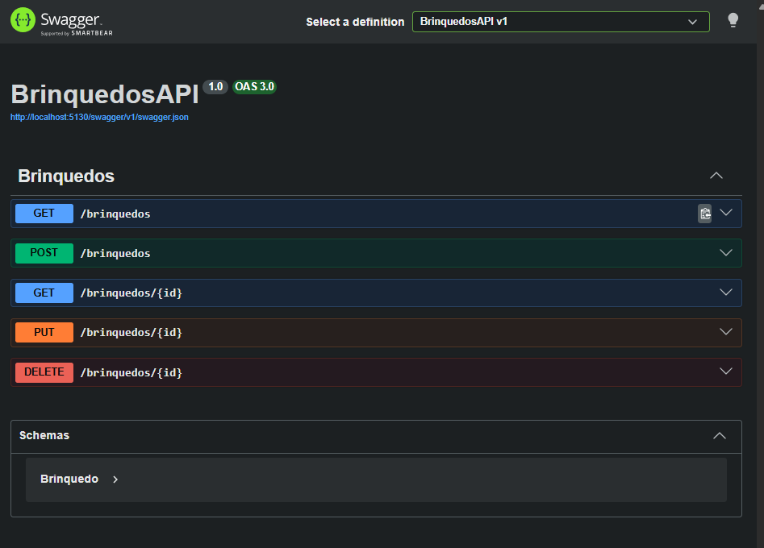
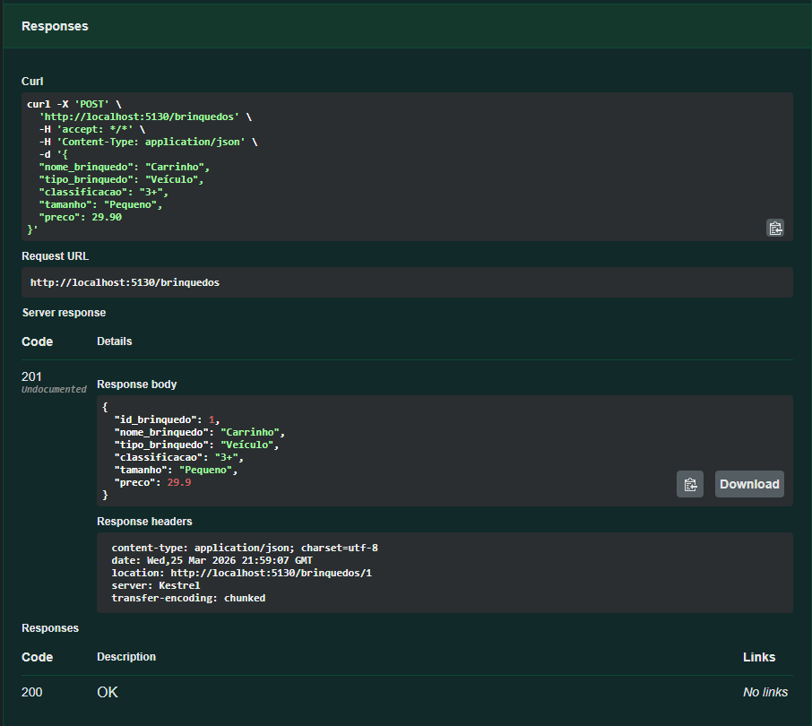
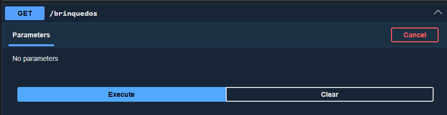
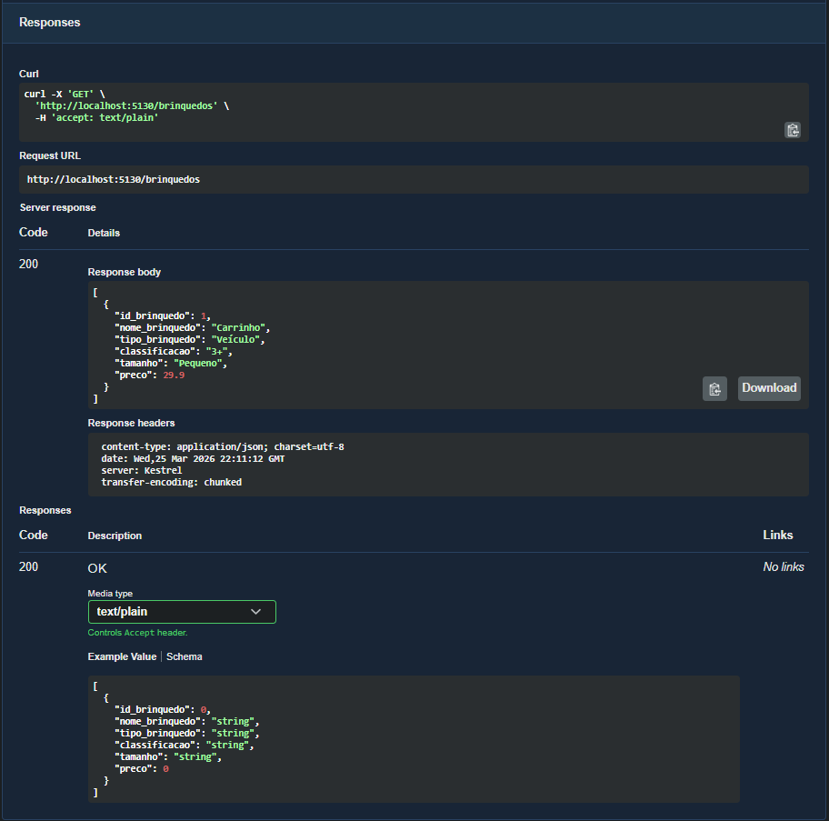
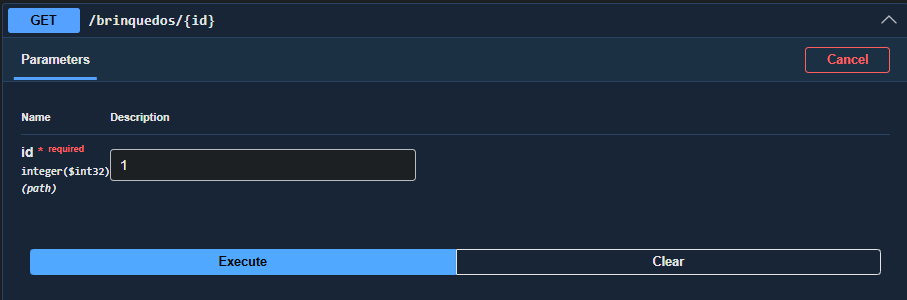
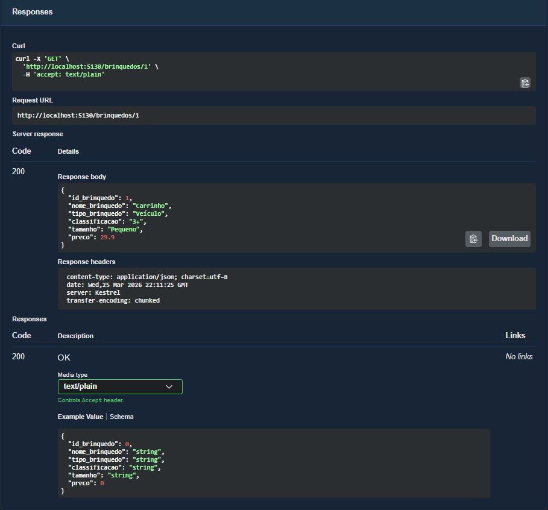
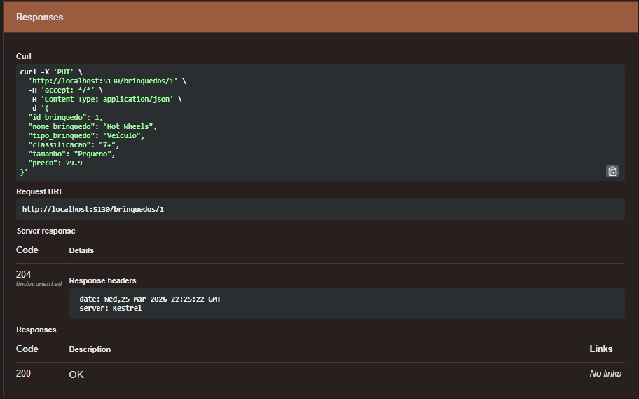
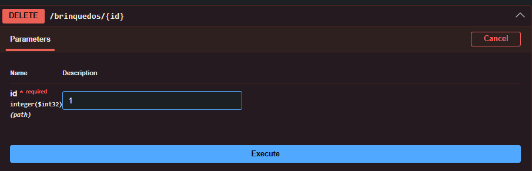
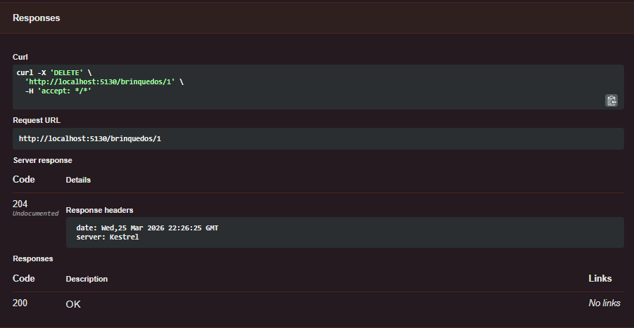
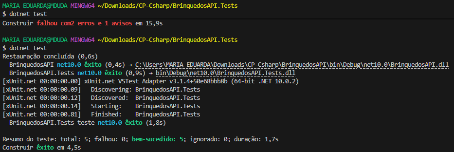

# 🧸 API de Gerenciamento de Brinquedos

## 📌 Descrição do Projeto

Este projeto consiste no desenvolvimento de uma **API RESTful em C# utilizando .NET**, com persistência de dados via **Entity Framework Core** e banco de dados **SQLite**.

A aplicação foi desenvolvida para gerenciar o cadastro de brinquedos destinados a crianças de até 14 anos, permitindo operações completas de **CRUD (Create, Read, Update e Delete)**.

Além disso, o projeto contempla:

* Documentação via Swagger
* Testes unitários com xUnit
* Persistência em banco relacional
* Organização em camadas (Controller, Model, Data)

---

## 🎯 Objetivo

Atender aos requisitos do Checkpoint 4 da disciplina, aplicando conceitos de:

* Desenvolvimento de APIs
* Integração com banco de dados
* Testes automatizados
* Boas práticas de organização de código

---

## 🛠️ Tecnologias Utilizadas

| Tecnologia            | Descrição                     |
| --------------------- | ----------------------------- |
| .NET 8                | Plataforma de desenvolvimento |
| C#                    | Linguagem principal           |
| Entity Framework Core | ORM para acesso ao banco      |
| SQLite                | Banco de dados leve           |
| Swagger               | Documentação e testes da API  |
| xUnit                 | Testes unitários              |

---

## ⚙️ Como Executar o Projeto

### 🔹 1. Clonar o repositório

```bash
git clone https://github.com/seu-usuario/seu-repositorio.git
cd BrinquedosAPI
```

### 🔹 2. Restaurar dependências

```bash
dotnet restore
```

### 🔹 3. Criar banco de dados

```bash
dotnet ef migrations add InitialCreate
dotnet ef database update
```

### 🔹 4. Executar aplicação 

```bash
dotnet run
```

---

## 🌐 Acesso à API

Após executar:

```
http://localhost:5130/swagger
```

---

## 📡 Endpoints da API

### 🔹 GET /brinquedos

Retorna todos os brinquedos cadastrados.

### 🔹 GET /brinquedos/{id}

Retorna um brinquedo específico.

### 🔹 POST /brinquedos

Cria um novo brinquedo.

### 🔹 PUT /brinquedos/{id}

Atualiza um brinquedo existente.

### 🔹 DELETE /brinquedos/{id}

Remove um brinquedo.

---

## 📸 Evidências do Projeto

### 🔹 Swagger (Endpoints disponíveis)



---

### 🔹 POST - Criar Brinquedo

**Requisição**


**Resultado**


---

### 🔹 GET - Listar Brinquedos

**Requisição**


**Resultado**


---

### 🔹 GET por ID

**Requisição**


**Resultado**


---

### 🔹 PUT - Atualizar Brinquedo

**Requisição**


**Resultado**


---

### 🔹 DELETE - Remover Brinquedo

**Requisição**


**Resultado**



## 🧪 Exemplo de Requisição (POST)

```json
{
  "nome_brinquedo": "Carrinho",
  "tipo_brinquedo": "Veículo",
  "classificacao": "3+",
  "tamanho": "Pequeno",
  "preco": 29.90
}
```

---

## 🧪 Testes Unitários

O projeto contém testes unitários utilizando **xUnit** e banco em memória (**InMemory Database**), garantindo isolamento entre os testes.

### ✔ Casos testados:

* Criação de brinquedo
* Listagem de brinquedos
* Busca por ID
* Atualização de dados
* Remoção de registro

### ▶️ Executar testes

```bash
dotnet test
```

---

### ✔ Testes unitários

Resultado com todos os testes executados com sucesso:

- Total de testes: 5  
- Testes aprovados: 5  
- Falhas: 0  



---

## 📂 Estrutura do Projeto

```
BrinquedosAPI/
│
├── Controllers/
│   └── BrinquedosController.cs
│
├── Data/
│   └── AppDbContext.cs
│
├── Models/
│   └── Brinquedo.cs
│
├── Program.cs
├── appsettings.json
│
BrinquedosAPI.Tests/
```

---

## 📌 Banco de Dados

O projeto utiliza **SQLite**, gerando automaticamente o arquivo:

```
brinquedos.db
```

A tabela criada contém os campos:

* Id_brinquedo
* Nome_brinquedo
* Tipo_brinquedo
* Classificacao
* Tamanho
* Preco

---

## 👥 Integrantes

* Maria Eduarda Araujo Penas
* RM: 560944

* Alane Rocha
* RM: 561052

---

## 📊 Resultados Obtidos

- API funcional com todos os endpoints operando corretamente
- Integração com banco SQLite validada
- Persistência de dados funcionando
- Testes unitários garantindo integridade das operações
- Documentação clara via Swagger

---

## 📌 Conclusão

O projeto demonstra a implementação completa de uma API REST integrada a banco de dados, com testes automatizados e documentação adequada, atendendo integralmente aos requisitos propostos no checkpoint.
